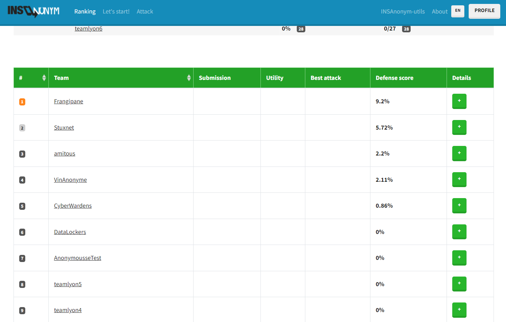

# Projet d'Anonymisation et Réidentification de Données du groupe `Stuxnet`

Ce projet a pour objectif d'explorer les techniques de défense utilisées pour anonymiser des données sensibles, ainsi que les techniques d'attaque pouvant contourner ces méthodes d'anonymisation. Le projet est organisé sous la forme d'une compétition organisée entre l'`INSA CVL` et l'`INSA LYON` sur la plateforme http://sds5000.insa-cvl.fr/.

## Contenu du Projet

Le jeu de données fourni pour ce projet est un fichier CSV contenant tous les pings de 69 individus ayant participé à une étude. Chaque ping représente la position d'un individu à un moment précis, exprimée en termes de latitude et de longitude. Certains individus émettent des pings chaque seconde, tandis que d'autres le font de manière moins fréquente. L'expérimentation a eu lieu sur une période de 11 semaines, allant de mars à juin 2018.

## Objectifs

- Analyser les techniques d'anonymisation des données dans le contexte des pings de localisation.
- Explorer les méthodes d'attaque potentielles visant à réidentifier les individus malgré l'anonymisation.
- Comprendre les enjeux de sécurité des données liés à la fréquence des pings et à la durée de l'expérimentation.
- Mettre en place des métriques d'intérêt et cohérentes avec le jeu de données fourni, pour évaluer l'utilité de l'anonymisation.

## Algorithmes Utilisés

- **Pour l'attaque :**
  
  Dans le dossier **partieAttaque**, le fichier `attackAlgorithms.py` contient les différents algorithmes utilisés :
    - **Jointure**
    - **Similitudes de trajectoire**

- **Pour la défense :**
  Dans le dossier **partieDefense**, le fichier notebook `anonymisationAlgorithms.py` contient les différentes fonctions utilisées pour anonymiser le jeu de données original.

- **Pour les métriques :**

  Dans le dossier **partieMetriques**, le fichier `metricsAlgorithms.py`contient l'implémentation des métriques proposées et la fonction de calcul de score associée.
   - **Mobilité des Lyonnais**
   - **Déplacement hebdomadaire**

  Les uses-cases de ces métriques sont proposées à travers le contexte suivant :

  **Contexte :** 
  Dans le cadre du développement de sa stratégie commerciale, la société Forter, spécialisée dans les `taxis-drones`,  vient d’acquérir une base de données anonymisée, sous forme de fichier csv, qui contient tous les pings de 69 personnes, résidant dans la ville de Lyon, qui ont participé à une étude. Un ping étant une ligne du fichier qui indique la position (représentée en termes de latitude et de longitude) d'un individu à un moment donné. Certains individus “ping” chaque seconde, et d’autres un peu moins  fréquemment. L’expérimentation a duré 11  semaines (≈ 3 mois), du mois de mars au mois juin 2018.
  Cette base de données va servir d’échantillon pour analyser les habitudes de déplacement des habitants de la métropole de Lyon.
  A partir de cette base de donnée anonymisée, Forter désire : 
  - Établir de nouveaux sites d’embarcation dans les villes françaises les plus fréquentées par les Lyonnais.
  - Ajuster le modèle financier et l’offre, à la demande potentielle des Lyonnais. Plus précisément, adapter les distances de trajet, aux distances moyennes que parcourent les Lyonnais, par semaine, et ajuster les tarifs en fonction (tarif plus élevé si les distances sont trop courtes ou trop grandes car risque de détérioration prématurée du moteur).

## Utilisation du Projet

Pour utiliser ce projet, assurez-vous de récupérer le fichier CSV original sur la plateforme, puis suivez les instructions fournies dans le code source pour lancer l'analyse des données. Vous trouverez également des informations détaillées sur les techniques d'anonymisation et les stratégies de défense mises en œuvre.

--
NB : Il faudra modifier les chemins de répertoire et de fichiers pour que les algorithmes fonctionnent.
**Note:** Respectez toujours les règles éthiques et légales lors de l'utilisation et de la manipulation de données sensibles.
